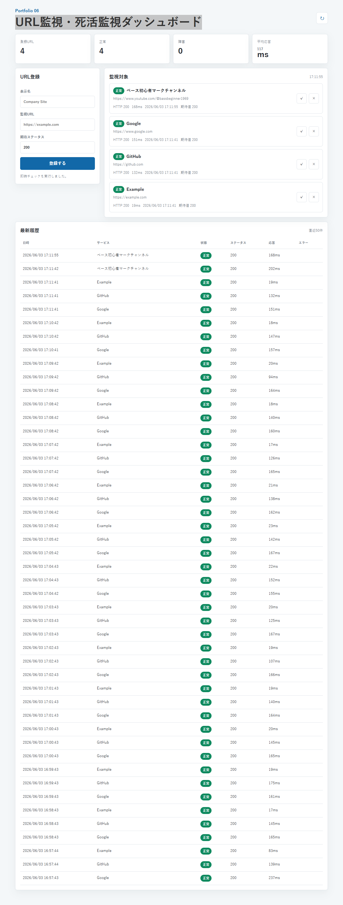

# Portfolio 06: URL監視・死活監視ダッシュボード

Goで作ったURL監視・死活監視ダッシュボードです。URLを登録するとバックグラウンドワーカーが定期的にHTTPチェックを実行し、ステータス、レスポンスタイム、履歴、障害状態をPostgreSQLに保存してダッシュボードへ表示します。



## 技術構成

- Go バックエンド
- PostgreSQL
- 静的HTML/CSS/JavaScriptフロントエンド
- URL登録、削除、即時チェック
- 定期監視
- レスポンスタイム記録
- ステータス履歴
- 障害検知
- Docker / Docker Compose対応

## 主な機能

- 監視URLの登録と削除
- 期待HTTPステータスの設定
- 60秒間隔の自動死活監視
- 手動での即時チェック
- HTTPステータス、応答時間、チェック日時の履歴保存
- 最新状態にもとづく正常・障害の判定
- 登録数、正常数、障害数、平均応答時間のサマリー表示

## アプリ構成

```text
.
├── cmd/server/main.go       # Go API、監視ワーカー、DB初期化
├── web/                     # ダッシュボードUI
├── screenshot/              # README掲載用スクリーンショット
├── Dockerfile               # Goアプリのコンテナ定義
└── docker-compose.yml       # App + PostgreSQL
```

## 起動

```bash
docker compose up -d --build
```

起動後、ブラウザで以下を開きます。

```text
http://localhost:8080
```

## PC再起動後も表示する設定

このプロジェクトは `docker-compose.yml` に `restart: unless-stopped` を設定しているため、Docker Desktopのエンジンが起動するとアプリとPostgreSQLコンテナが自動復帰します。

PC再起動後も `http://localhost:8080` を継続して表示したい場合は、Docker Desktopで以下を有効にしてください。

1. Docker Desktopを開く
2. Settings > General を開く
3. `Start Docker Desktop when you sign in` を有効にする

初回または設定変更後は、以下を一度実行します。

```bash
docker compose up -d --build
```

以後はPC再起動後、Docker Desktopが起動すると自動的に `portfolio06-app-1` と `portfolio06-db-1` が復帰します。

停止したい場合は以下を実行します。

```bash
docker compose down
```

## API

- `GET /api/services` 登録URL一覧
- `POST /api/services` URL登録
- `DELETE /api/services/{id}` URL削除
- `POST /api/services/{id}/check` 即時チェック
- `GET /api/checks?service_id={id}` チェック履歴
- `GET /api/stats` 全体統計
- `GET /health` アプリのヘルスチェック

## 補足

初回起動時にサンプルとして Google、GitHub、Example を登録します。PostgreSQLのデータはDocker volumeに保存されるため、コンテナを再起動しても監視履歴は残ります。
